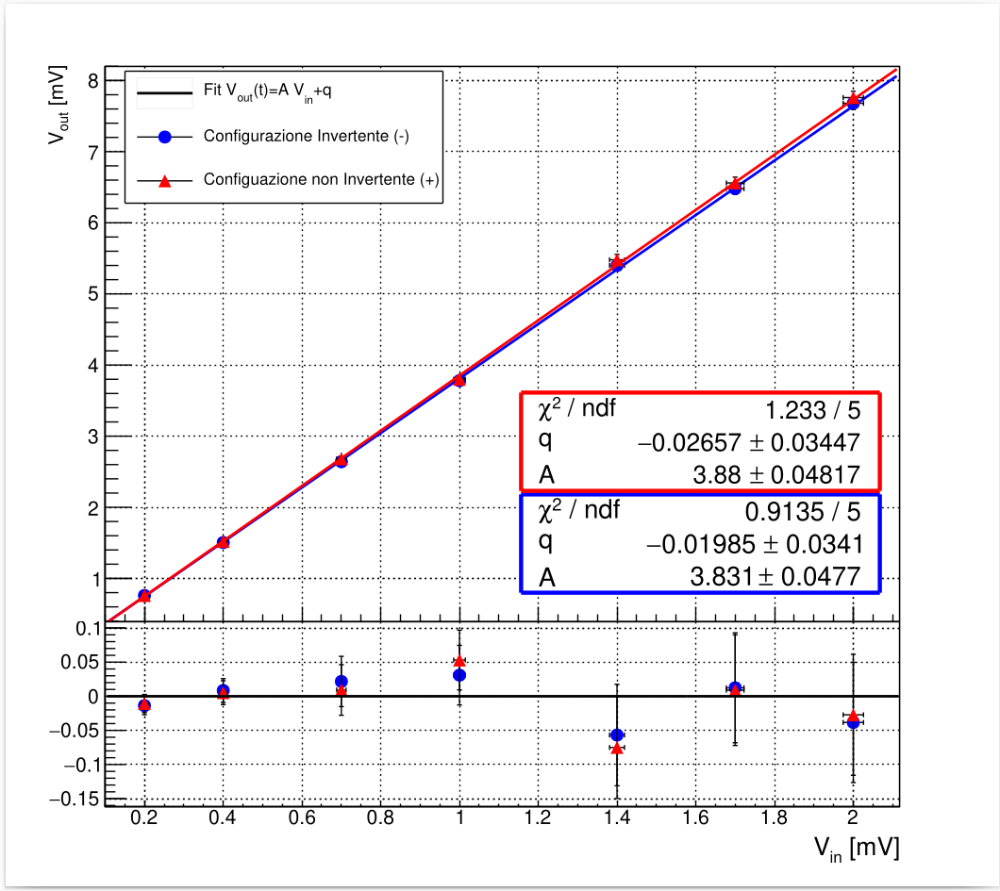
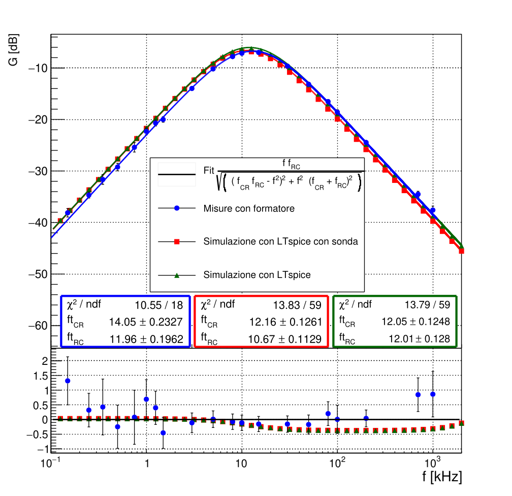

Here I am uploading some ROOT scripts I wrote during my undergraduate physics laboratories. They might not be perfect, but I believe they capture some useful features that are sometimes difficult to find in forums and documentation.

**Requirements**

ROOT: The code relies on the ROOT data analysis framework. You can download and install ROOT from https://root.cern

**line2.c** is a simple script to plot two TF1 with residuals in the same canvas.

Usage in ROOT env:
.L line2.c
line2(file1,file2,inf,sup)

file with classic root tsv format x y sx sy.
Range of x axys: [inf,sup]

**bode_form.c**

This C++ code is designed to analyze and visualize frequency response data, commonly used in signal processing or electrical circuit analysis. It uses the ROOT data analysis framework to fit the data to a mathematical model and visualize the results on a Bode plot. The code also calculates and displays residuals to evaluate the quality of the fit.

Features:

Bode Plot Generation: Generates a frequency response plot (Bode plot) with logarithmic scaling for the x-axis (frequency).

Curve Fitting: Fits the data to a model using the TF1 fitting function (customizable for different models).

Residuals Plot: Calculates and displays residuals (differences between the data and the fit).

Data Visualization: Supports multiple data sets and includes fit statistics.

Data Conversion: Converts LTSpice simulation data into a compatible format for analysis.

